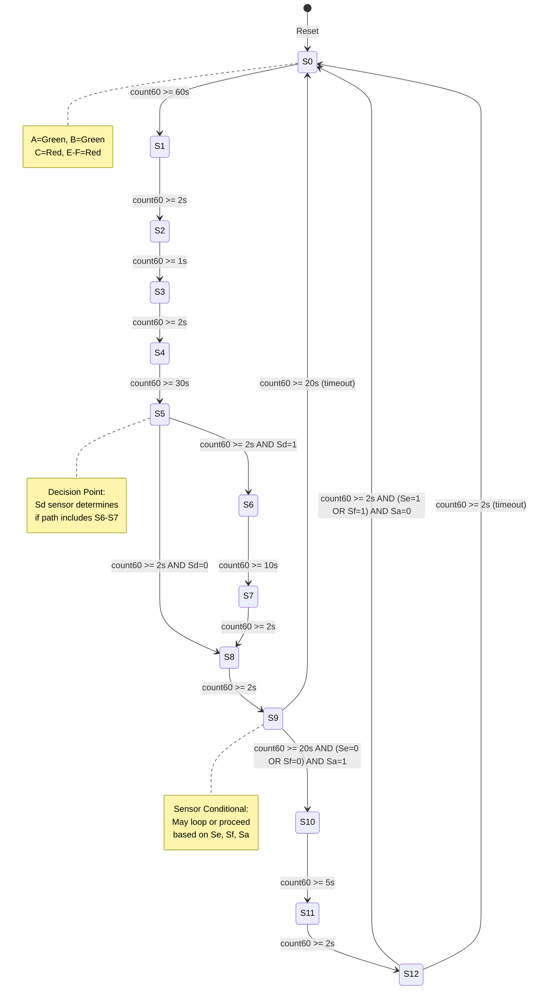
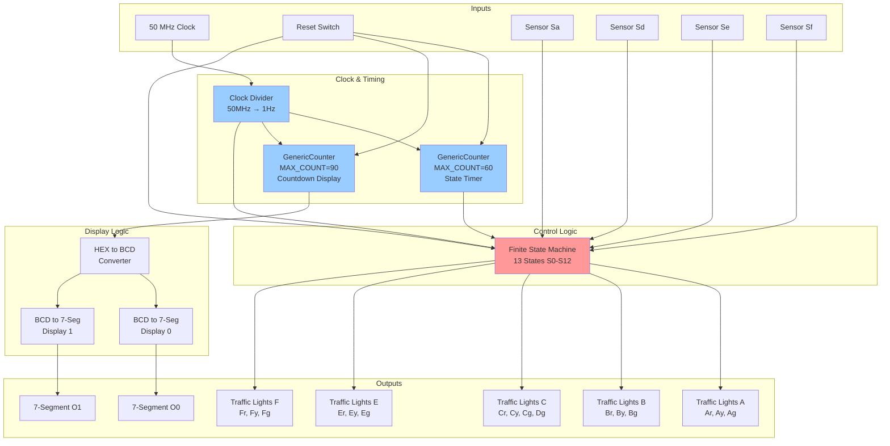
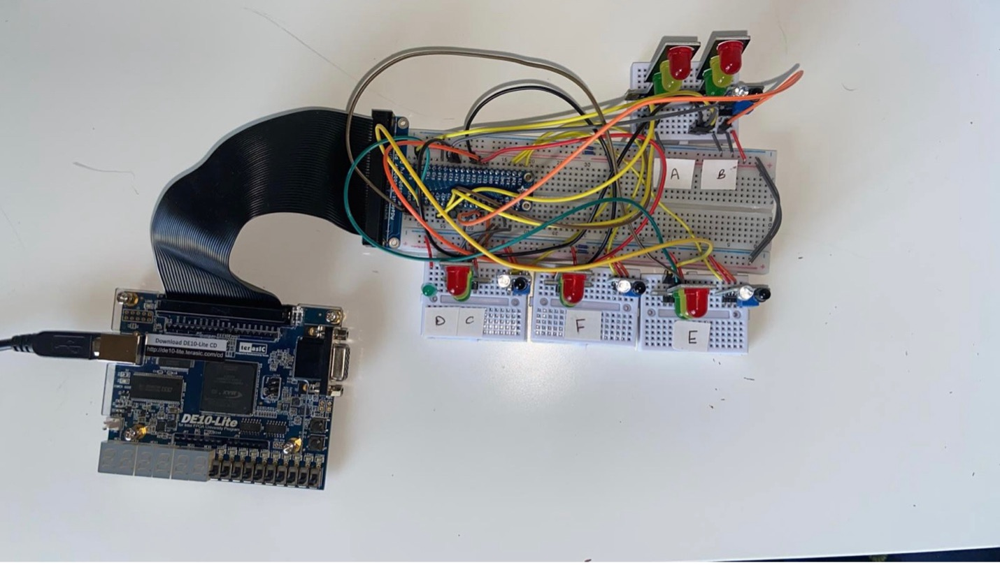
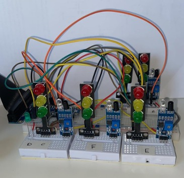
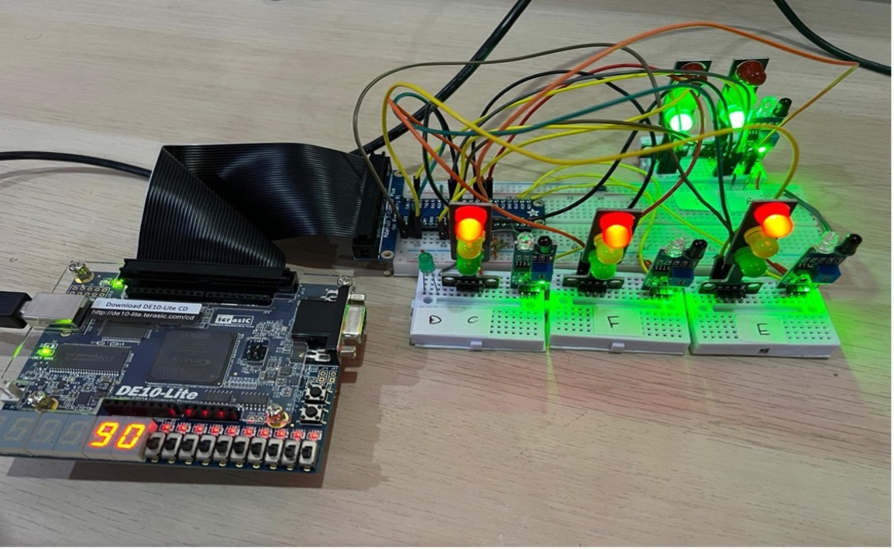

# Traffic Lights Controller

A VHDL-based traffic light controller system implementing an Algorithm State Machine (ASM) for managing traffic flow at a multi-segment intersection.

**Author:** Eman Sarah Afi (A00051)  
**Institution:** American University of Bahrain  
**Course:** CMPE 470L Final Project

## Table of Contents

- [Traffic Lights Controller](#traffic-lights-controller)
  - [Table of Contents](#table-of-contents)
  - [Objective](#objective)
  - [Introduction](#introduction)
    - [Problem Statement](#problem-statement)
  - [Opening the Project in Quartus](#opening-the-project-in-quartus)
  - [Project Structure](#project-structure)
    - [Core Components](#core-components)
    - [Configuration Files](#configuration-files)
  - [System Architecture](#system-architecture)
    - [Control Units](#control-units)
    - [Inputs](#inputs)
    - [Outputs](#outputs)
  - [Traffic Signal Flow](#traffic-signal-flow)
    - [State Machine Diagram](#state-machine-diagram)
    - [Block Diagram](#block-diagram)
  - [Hardware Implementation](#hardware-implementation)
    - [Circuit Images](#circuit-images)
    - [Required Components](#required-components)
    - [Pin Assignments](#pin-assignments)
  - [Testing \& Results](#testing--results)
  - [Conclusion](#conclusion)

## Objective

This project implements a complete traffic light control system using VHDL, demonstrating the integration of:

- Finite State Machine (FSM) design using Algorithm State Machines (ASM)
- Digital logic circuit design and implementation
- Intel Quartus IDE software
- Terrasic DE-10 Lite FPGA board
- Real-world hardware interfacing

## Introduction

An Algorithm State Machine (ASM) is a method for designing Finite State Machines that control system behavior based on inputs and current states. This project implements a real-life traffic light system with multiple segments (A, B, C, D, E, F), sensor-based decision making, and timed state transitions.

### Problem Statement

Design and implement a traffic light controller that:

- Manages traffic flow across 5 segments with 6 traffic light groups
- Responds to infrared barrier sensors (Sa, Sd, Se, Sf)
- Displays countdown timer on 7-segment displays
- Follows a specific state sequence with conditional transitions
- Operates on FPGA hardware with physical LED traffic lights

## Opening the Project in Quartus

1. **Launch Quartus II/Quartus Prime**
   - Open Intel Quartus software on your computer

2. **Open the Project**
   - Go to \`File\` → \`Open Project...\`
   - Navigate to this directory
   - Select \`FinalProject.qpf\` and click \`Open\`

3. **Set the Top-Level Entity** (if needed)
   - Go to \`Project\` → \`Set as Top-Level Entity\`
   - Select \`FinalProject\`

4. **Compile the Design**
   - Click \`Processing\` → \`Start Compilation\` (or press Ctrl+L)
   - Wait for compilation to complete

5. **Program the FPGA** (if hardware is connected)
   - Go to \`Tools\` → \`Programmer\`
   - Click \`Hardware Setup\` and select your FPGA board
   - Click \`Start\` to program the device

## Project Structure

### Core Components

- **\`FinalProject.vhd\`** - Top-level entity integrating all components
- **\`FiniteStateMachine.vhd\`** - FSM controlling traffic light state transitions
- **\`GenericCounter.vhd\`** - Parameterized counter (configurable max count 1-255)
- **\`ClockDivider.vhd\`** - Clock divider (50 MHz to 1 Hz)
- **\`HEXtoBCD.vhd\`** - Hexadecimal to BCD converter
- **\`BCDto7Seg.vhd\`** - BCD to 7-segment display decoder

### Configuration Files

- \`FinalProject.qpf\` - Quartus project file
- \`FinalProject.qsf\` - Quartus settings file
- \`.gitignore\` - Git ignore rules for generated files

## System Architecture

### Control Units

1. **Clock Pulse Converter** - Converts onboard 50 MHz to 1 Hz
2. **Timing System** - GenericCounter (0-60) with state-based reset
3. **Timer Display** - GenericCounter countdown (90-0) for East segment
4. **HEX to BCD Converter** - Converts timer output for display
5. **BCD to 7-Segment Decoders** - Drives two 7-segment displays

### Inputs

- \`clk\` - 50 MHz onboard clock
- \`Reset\` - Master reset switch
- \`Sa, Sd, Se, Sf\` - Infrared barrier sensors (active low)

### Outputs

- \`O0, O1\` - Two 7-segment displays (timer countdown)
- **Traffic Lights:**
  - \`Ar, Ay, Ag\` - Traffic lights A (East segment)
  - \`Br, By, Bg\` - Traffic lights B (East segment)
  - \`Cr, Cy, Cg, Dg\` - Traffic lights C & D (West segment)
  - \`Er, Ey, Eg\` - Traffic lights E (North segment)
  - \`Fr, Fy, Fg\` - Traffic lights F (South segment)

## Traffic Signal Flow

The system operates through 13 states (S0-S12) with the following sequence:

| State | A | B | C | D | E-F | Duration | Conditions |
|-------|---|---|---|---|-----|----------|------------|
| S0 | G | G | R | - | R | 60s | - |
| S1 | G | Y | R | - | R | 2s | - |
| S2 | G | R | R | - | R | 1s | - |
| S3 | G | R | Y | - | R | 2s | - |
| S4 | G | R | G | - | R | 30s | - |
| S5 | Y | R | G | - | R | 2s | Sd determines next state |
| S6 | R | R | G | G | R | 10s | If Sd = 1 |
| S7 | R | R | Y | - | R | 2s | - |
| S8 | R | R | R | - | Y | 2s | If Sd = 0, skip S6-S7 |
| S9 | R | R | R | - | G | 20s | Sensor conditional |
| S10 | R | R | R | - | G | 5s | If (Se=0 or Sf=0) & Sa=1 |
| S11 | R | R | R | - | Y | 2s | - |
| S12 | Y | Y | R | - | R | 2s | Return to S0 |

**Legend:** G=Green, Y=Yellow, R=Red

### State Machine Diagram

### Block Diagram

## Hardware Implementation

### Circuit Images

*Top view of the traffic light controller circuit implementation*

*Hardware circuit with all components connected*

*Traffic light controller in operation showing active LEDs*

### Required Components

- Terrasic DE-10 Lite FPGA board
- Breadboard and 4 mini modular breadboards
- 4× Active-low infrared barrier sensors (Sa, Sd, Se, Sf)
- 5× Mini 5V traffic light LED modules (for A, B, C, E, F)
- 1× Green LED (for D segment)
- Connecting wires

### Pin Assignments

Refer to the Quartus project settings file (\`FinalProject.qsf\`) for complete pin assignments for:

- Input sensors (Sa, Sd, Se, Sf)
- Reset switch
- 7-segment displays (O0, O1)
- All traffic light outputs (16 pins total)

## Testing & Results

The system was tested by:

1. Compiling the VHDL modules in Quartus without errors
2. Programming the Terrasic DE-10 Lite board
3. Connecting physical traffic light LEDs and sensors
4. Observing state transitions according to the ASM flow

## Conclusion

This project successfully demonstrates:

- ASM-based FSM design from real-world requirements
- Clock pulse conversion using VHDL
- Generic parameterized counter design for reusable timing modules
- Hexadecimal to BCD conversion using mathematical operations
- 7-segment display interfacing
- Sensor-based conditional state transitions
- Complete hardware-software integration on FPGA

The system provides a functional traffic light controller that responds to sensor inputs and manages complex multi-segment traffic flow according to specified timing and conditions. The use of a single `GenericCounter` module demonstrates efficient code reusability and maintainability in VHDL design.
